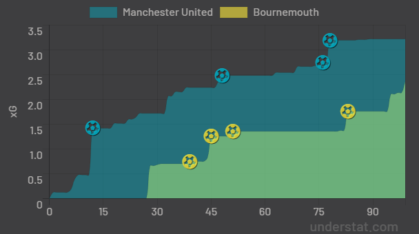

# Manchester United vs Bournemouth — Match Performance Summary

## Match Information
- Competition: Premier League  
- Fixture: Manchester United vs Bournemouth  
- Final Score: 4–4  
- Analysis Type: Post-Match Performance Summary  
- Data Sources: FBref, Understat  

---

## Development Context
This analysis builds directly on the framework established in the **Chelsea vs Everton** match report.

While the first project focused on establishing reliable team-level performance metrics, this second analysis introduces **match dynamics and event-based context**, allowing for a more complete numerical description of the game without increasing tactical interpretation.

---

## Team-Level Performance Overview

### Shots & Expected Goals (xG)

Manchester United recorded a higher total expected goals value, while Bournemouth also accumulated a high xG total, resulting in a relatively small separation between teams.

This differs from the Chelsea vs Everton match, where one team clearly outperformed the other across both shot volume and xG.

---

## Shot Outcome Breakdown

Shot outcomes were categorised into:
- Goals  
- Shots Saved  
- Shots Blocked  
- Shots Off Target  

Both teams converted a comparatively high proportion of shots into goals, reflecting a match characterised by repeated high-value chances rather than isolated finishing events.

---

## Shot Distance Distribution

Shots were grouped into four distance zones:
- 0–6 yards  
- 6–12 yards  
- 12–18 yards  
- 18+ yards  

Manchester United generated a greater number of shots from central and closer distance zones, while Bournemouth recorded a higher share of attempts from medium and longer distances, while still maintaining sufficient close-range activity to sustain xG output.

---

## Match Dynamics: Shot Timing (New)

To better describe how the match evolved, shots were grouped into defined match phases.

Key characteristics:
- Sustained shot volume across both halves
- Increased attacking activity in later match phases
- No prolonged low-activity periods

This temporal consistency aligns with the final scoreline and represents a clear analytical extension beyond the first match report.

---

## Goal Event Summary (New)

Goal events were extracted to provide an event-level overview.

| Minute | Team               | Player            | xG   |
|-------:|--------------------|-------------------|------|
| 13     | Manchester United  | Amad Diallo       | 0.97 |
| 40     | Bournemouth        | Antoine Semenyo   | 0.13 |
| 46     | Bournemouth        | Evanilson         | 0.29 |
| 52     | Bournemouth        | Marcus Tavernier | 0.12 |
| 77     | Manchester United  | Bruno Fernandes  | 0.07 |
| 79     | Manchester United  | Matheus Cunha    | 0.63 |
| 84     | Bournemouth        | Eli Junior Kroupi| 0.23 |

Goals occurred across multiple match phases, with several high-xG events contributing to the late volatility of the match.

---

## Understat Contextual Reference (New)

Understat visuals were used to provide spatial and temporal context to the FBref-derived metrics.

### Shot Location Map
The shot map illustrates sustained access to central and high-value shooting areas by both teams.

---

### Expected Goals Timeline
The xG timeline shows continuous accumulation throughout the match, with no extended flat periods, indicating frequent attacking events across both halves.

---

## Summary Metrics Comparison

| Metric                   | Manchester United | Bournemouth |
|--------------------------|-------------------|-------------|
| Total Shots              | High              | High        |
| Total xG                 | Higher            | High        |
| Shot Distance Profile    | More Central      | More Mixed  |
| Shot Timing Distribution | Sustained         | Sustained  |

---

## Methodology Notes
- All numerical metrics were derived from publicly available FBref data
- Python was used for data cleaning, aggregation, and validation
- Power BI was used for dashboarding and visual communication
- Understat visuals were used exclusively for contextual reference
- Tactical interpretation is intentionally limited at this stage

---

## Development Summary
Relative to the Chelsea vs Everton analysis, this project introduces:
- Shot timing analysis
- Goal event extraction
- Multi-source contextual integration

Future analyses will continue to build on this structure while maintaining consistency in core metrics.

